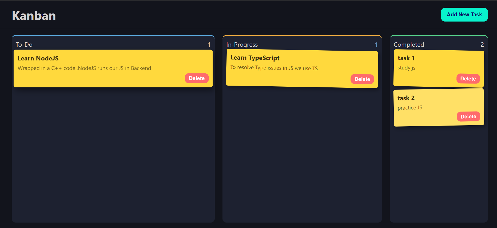
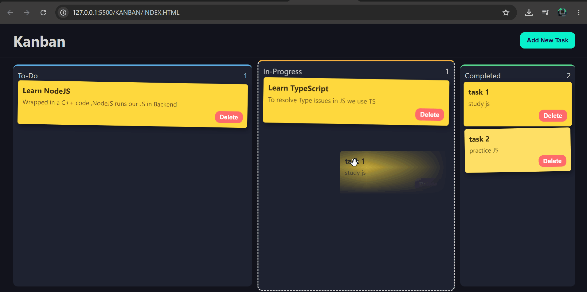

# Sticky

A drag-and-drop kanban board, styled like an actual board of sticky notes. No frameworks, no UI libraries — just HTML, CSS, and vanilla JavaScript doing the work directly.

I built this mainly to get comfortable with the DOM on its own terms, before reaching for something like React to do it for me. Turns out there's a lot you only really understand once you've wired up drag events, event delegation, and localStorage persistence by hand.

## Demo





## What it does

- Three columns — To Do, In Progress, Done — and you can drag a task card between any of them
- Add new tasks through a modal (title + description)
- Delete a task with one click
- Everything persists in `localStorage`, so your board survives a refresh
- Each column shows a live count of how many tasks are sitting in it

## Built with

- HTML5
- CSS3 (custom properties, no preprocessor)
- Vanilla JavaScript (ES6+)
- The native Drag and Drop API
- `localStorage` for persistence

That's it. No build step, no `node_modules`. Open `index.html` and it runs.

## Why vanilla JS

It would've been faster to wrap this in a framework and let it handle state and re-rendering for me. But the whole point was to actually see what's happening — when a card moves columns, *I'm* the one calling `appendChild`. When I need to know what's being dragged, *I* have to track it myself, because the browser doesn't hand it to you for free the way you'd expect. That kind of friction is annoying in the moment and genuinely useful in hindsight — it's the same DOM manipulation a framework is abstracting away, just without the abstraction.

## How this came together

I didn't write this in one pass — it went through a few honest iterations, and I think the progression is worth keeping visible rather than squashing it into one tidy commit.

**v1 — getting it working at all.** First pass was about wiring up the basics: grabbing the columns from the DOM, getting `dragover`/`dragenter`/`dragleave`/`drop` to actually cooperate (the `preventDefault()` on `dragover` took embarrassingly long to track down), and figuring out how to track which card was being dragged since the API doesn't make that obvious. Also got localStorage saving and restoring tasks on reload.

**v2 — applying DRY.** Once it worked, the duplication was obvious — the same "recount tasks, rebuild the save object, write to localStorage" block was copy-pasted in two different places, and so was the task-card markup. Pulling both into single functions wasn't just cleaner — it actually surfaced two real bugs that had been hiding in the duplicated code (a typo that meant nothing was being saved under the right key, and an undefined variable reference that would've broken adding new tasks entirely). DRY isn't just about tidiness; it's where bugs like that get caught.

**v3 — giving it real structure.** The script originally just ran top to bottom as the file loaded. I restructured it around named functions — `createTaskCard`, `saveBoardState`, `loadBoardState`, `setupColumnDragEvents` — all wired together through one `init()` function. Delete handling went in here too, using event delegation (one listener on the document, instead of wiring up a listener per button) so any task card, old or new, gets delete-button behavior automatically.

**v4 — the CSS pass.** Last step was making it look intentional instead of default. Moved everything onto CSS custom properties (`:root` + `var()`) so colors and spacing are defined once and reused everywhere. The sticky-note yellow against a dark blue-grey background isn't arbitrary — yellow and blue sit close to opposite each other on the color wheel, which is why the cards visually pop the way real sticky notes do. Each column also got a thin accent stripe (cool blue → warm amber → green) that maps to its place in the workflow.

## Project structure

```
.
├── index.html
├── style.css
└── script.js
```

## Running it locally

No dependencies, no install step:

```bash
git clone <your-repo-url>
cd sticky
```

Then just open `index.html` in your browser. That's the whole setup.

## What's next

A few things I know are missing and want to come back to:

- Editing an existing task instead of only delete-and-recreate
- Better mobile support — drag and drop doesn't behave the same on touch
- Maybe swapping `localStorage` for something that isn't tied to one browser

---

If you spot something that could be cleaner, I'd genuinely like to hear it — this whole project has mostly been an excuse to learn by breaking things and fixing them properly.
